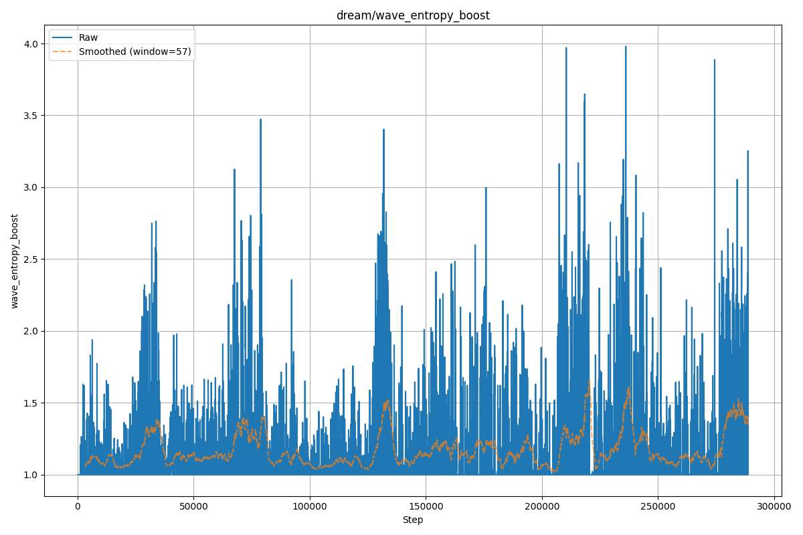
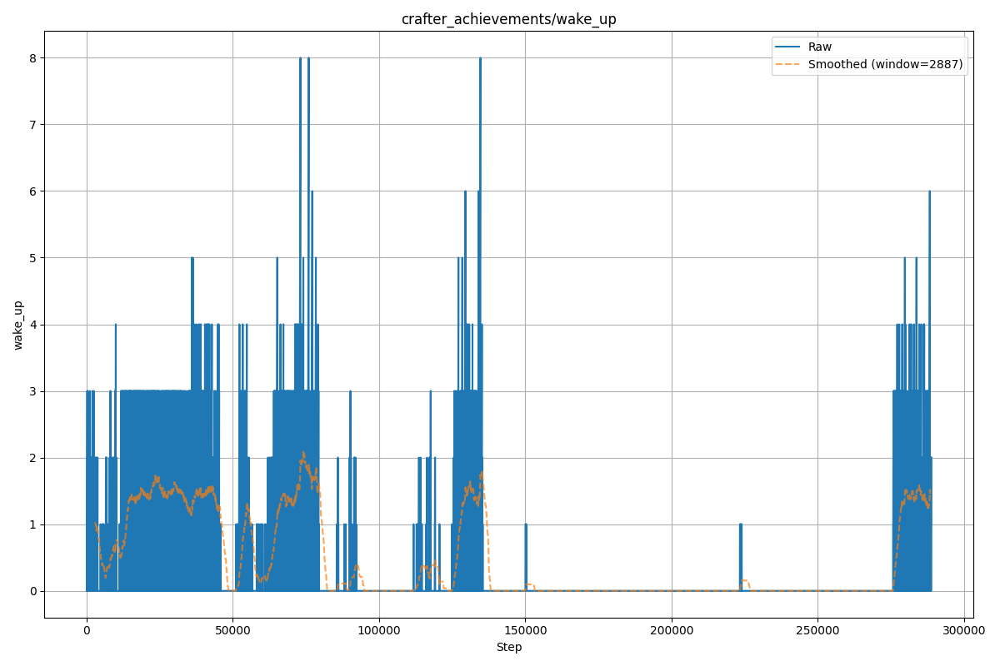
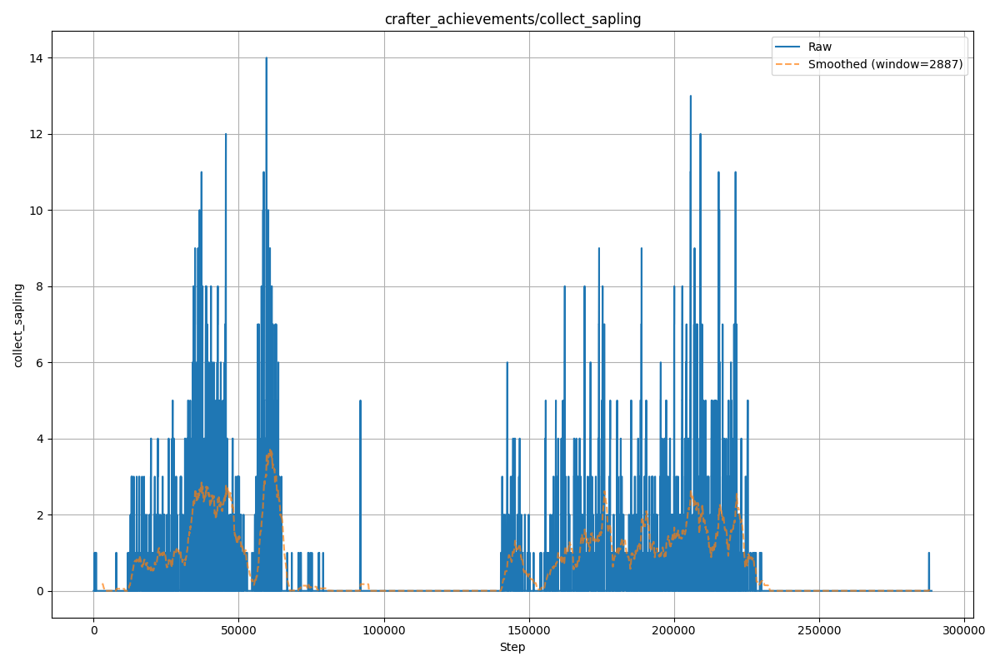
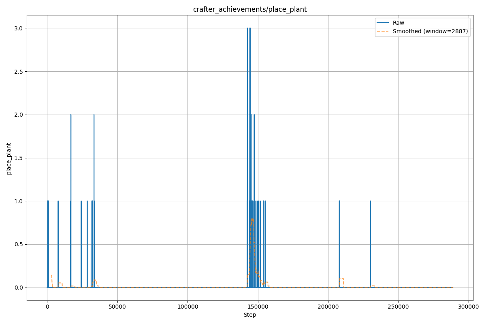
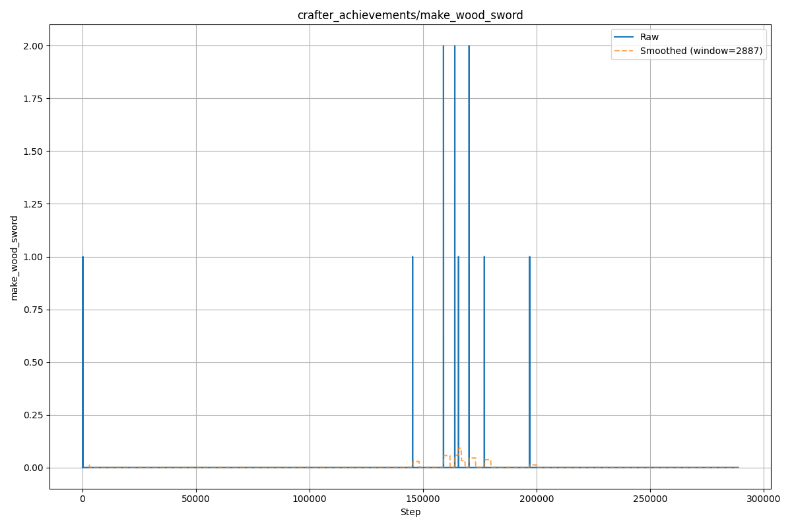
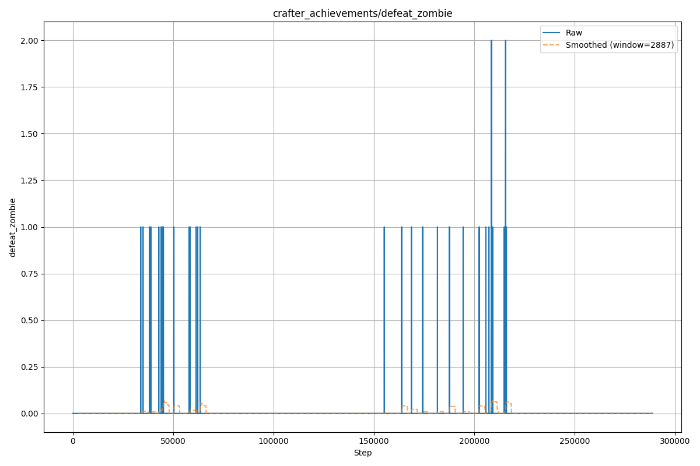

# DTC: An Intrinsically Motivated Agent for Emergent Curriculum Learning

**Author:** augo-augo (Independent Researcher)  
**Version:** 1.0 (October 2025)

[](https://arxiv.org)
[](https://github.com/augo-augo/DTC-agent)
[](https://wandb.ai/bsingleton-art-scgwt/scgwt-crafter/runs/5dz500gm?nw=nwuserbsingletonart)

---

## Abstract

This repository contains the official implementation of the **DTC (Dual-Timescale Competence)** agent, a model-based reinforcement learning agent designed for open-ended learning without external rewards. The agent's behavior is driven by a novel intrinsic reward mechanism, **Dual-Timescale Competence**, which models "boredom" as the convergence of fast and slow exponential moving averages (EMAs) of epistemic novelty. This competence-driven signal is used by a **Cognitive Wave Controller** to dynamically modulate policy entropy, creating an adaptive exploration-exploitation cycle.

When evaluated in the open-ended Crafter environment, the DTC agent demonstrates the emergence of a multi-stage developmental curriculum, progressing from simple survival skills to a "boredom trough," followed by the compositional discovery of more complex behaviors like agriculture and tool use. The architecture includes "hardened" intrinsic rewards that verifiably solve common pathologies, including the "dark room" problem and catastrophic forgetting, the latter of which is replaced by a "graceful skill deprecation" behavior.

---

## Core Mechanisms

The agent's behavior is an emergent property of three core mechanisms:

### 1. Dual-Timescale Competence (The "Boredom" Signal)

The primary reward component is $R_{comp}$, derived from two EMAs of epistemic novelty ($N_{epi,t}$):

- **`ema_fast`** ($\alpha=0.2$): Tracks short-term learning progress
- **`ema_slow`** ($\alpha=0.01$): Tracks long-term, stable knowledge

The competence reward is calculated as the difference between the slow and fast EMAs:

$$R_{comp} = N^{slow}_{t-1} - N^{fast}_t$$

- **When Learning:** $N^{fast}$ is high, so $R_{comp}$ is positive
- **When Mastered:** $N^{fast}$ drops to match $N^{slow}$, so $R_{comp} \to 0$. This "boredom" signal (a lack of competence reward) removes the incentive to practice mastered skills

This dynamic is visible in the agent's training logs (see W&B link above), where the competence reward oscillates as tasks are imagined, mastered, and discarded during "dreamed" rollouts.

### 2. Cognitive Wave (The "Exploration" Driver)

The agent acts on "boredom" via the `CognitiveWaveController`. This controller tracks the overall `stimulus_level` (a running mean of novelty). When this level drops, indicating mastery and stagnation, the controller boosts exploration pressure by scaling:

- **`dream_entropy_scale`** (×10.0)
- **`actor_entropy_scale`** (×5.0)

This forces the agent to explore more diverse, novel policies in its imagination, allowing it to break out of local optima and discover the next set of learnable skills. This mechanism is the direct cause of the agent's developmental breakthroughs.

  
*Figure 1: The Cognitive Wave Controller boosts dream entropy during periods of low environmental stimulus (boredom), enabling breakthrough discoveries.*

### 3. Pathology Hardening (The "Safety" Net)

The intrinsic reward function is "hardened" against common failures:

- **"Dark Room" Problem:** A safety penalty $R_{safety}$ is applied when observation entropy $H[o_t]$ drops below a floor $H_{min}$. The agent verifiably learns to avoid these low-entropy states in its dreams and seeks more complex observations in the environment
- **Latent Space Drift:** Novelty is calculated from *observation-space* disagreement (via a frozen decoder head), not latent-space, preventing the agent from "gaming" its own model

---

## Key Results: Emergent Developmental Stages in Crafter

Driven only by these internal signals—**without any external rewards or curriculum engineering**—the agent's training run reveals a clear, multi-stage curriculum.

### Phase I & II: Skill Mastery and "Boredom Trough" (~0k - 140k steps)

The agent first masters basic skills like `wake_up`. Once mastered (~80k steps), the DTC "boredom" signal kicks in, and the agent *stops* performing the skill. This is not catastrophic forgetting; it is **graceful skill deprecation**.

  
*Figure 2: The agent masters `wake_up` in early training, then abandons it as the competence reward drops to zero.*

### Phase III & IV: "Agricultural Revolution" and Second Cycle (~140k+ steps)

The exploratory pressure built during the "Boredom Trough" (Figure 1) leads to a cascade of compositional discoveries:

1. The agent discovers `collect_sapling` (~140k steps)
2. This immediately unlocks the repeatable, high-level strategy of `place_plant` (farming)
3. This new paradigm supports other advanced skills like combat and resource gathering

  
*Figure 3: Discovery of `collect_sapling` marks the beginning of the "agricultural revolution."*

  
*Figure 4: The agent masters `place_plant` (farming), a compositional skill requiring sapling collection.*

  
*Figure 5: Tool-making behaviors like `make_wood_sword` emerge after establishing resource pipelines.*

  
*Figure 6: Combat skills appear naturally once the agent has weapons and confidence.*

4. After mastering this new set of skills (~220k steps), the agent again becomes "bored," and the cycle repeats

---

## Why This Matters

Most RL agents require carefully shaped reward functions and curriculum design. The DTC agent demonstrates that complex, structured behavior can emerge from simple intrinsic drives, suggesting a path toward more autonomous, self-directed AI systems. The "hardened" pathology fixes make this approach actually reliable in practice.

---

## Getting Started

This project is a standard Python package, configured with `omegaconf` and built on `torch`.

### 1. Clone and Install (Conda Recommended)

For GPU-accelerated training, install the core CUDA-enabled dependencies with `conda` before using `pip` for the remaining Python packages.

```bash
# Clone the repository
git clone https://github.com/augo-augo/DTC-agent.git
cd DTC-agent

# Create a conda environment with PyTorch and FAISS that match your CUDA toolkit
conda create -n dtc python=3.10 pytorch-cuda=11.8 pytorch faiss-gpu -c pytorch -c conda-forge

# Activate the environment
conda activate dtc

# Install the package in editable mode (installs remaining dependencies from pyproject.toml)
pip install -e .
```

### 2. Run Tests

Ensure all components are functioning correctly by running the `pytest` suite:

```bash
pytest
```

### 3. Run a Test Agent

You can run a lightweight version of the agent on your CPU using the `testing.yaml` config:

```bash
python -m dtc_agent.training --config configs/testing.yaml --device cpu
```

### 4. Run the Full Experiment

The full experiment (as seen in the W&B logs) uses the `default.yaml` config and requires a CUDA-enabled GPU:

```bash
# This requires a CUDA-enabled GPU and W&B setup
python -m dtc_agent.training --config configs/default.yaml --device cuda
```

---

## Citation

If you find this work useful in your research, please cite the following paper:

```bibtex
@article{kilfoy2025dtc,
  title={DTC: Emergent Developmental Curricula from a Dual-Timescale Competence Drive},
  author={Kilfoy, Benjamin},
  journal={arXiv preprint arXiv:2501.XXXXX},
  year={2025}
}
```

*(Update with your arXiv link once published)*

---

## License

This project is licensed under the **MIT License**. See the `LICENSE` file for details.

---

## Contact

For questions or collaboration inquiries, please open an issue on GitHub or contact the author directly.
